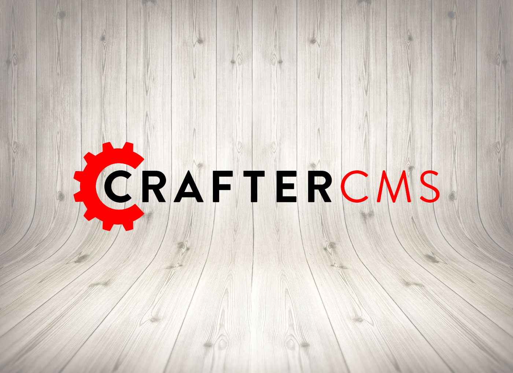

CrafterCMS is a modern open source content management system. CrafterCMS is [composable](https://www.gartner.com/smarterwithgartner/gartner-keynote-the-future-of-business-is-composable), [headless+](https://www.gartner.com/en/documents/3970519), and doesn't dictate your technology choices.

CrafterCMS can run as a content server alongside your web or mobile application, and/or host templated web applications.

CrafterCMS itself is built with Java and uses Groovy and FreeMarker as the controller and view layers respectively, however, CrafterCMS doesn't interfere with your technology choices. CrafterCMS ships an SDK on NPM that helps you wire in-context editing features ([Experience Builder](https://docs.craftercms.org/en/4.0/developers/experience-builder.html)) so you can wire that to your favorite front-end technology like React, Vue, Angular or anything else. If you're building your application pure headless, then nothing is needed, you can simply call CrafterCMS for content and search capabilities via the REST API.

## Learn More
Start learn more about CrafterCMS:
* [Architecture](https://docs.craftercms.org/en/4.0/developers/architecture.html#architecture)
* [Getting Started](https://docs.craftercms.org/en/4.0/getting-started/index.html)
* [Download and Run](https://craftercms.org/downloads)
* [Ask Questions](https://craftercms.com/slack)

## Contributing
CrafterCMS is open source and welcomes [external contributions](https://github.com/craftercms/craftercms/blob/develop/CONTRIBUTORS.md). You can contribute in several ways:
* Contribute [extensions](https://docs.craftercms.org/en/4.0/developers/extensions/index.html) to the [marketplace](https://craftercms.com/marketplace)
* Help us with [documentation](https://docs.craftercms.org/en/4.0/contribute/index.html)
* File bugs [here](https://github.com/craftercms/craftercms/issues)
* Contribute code fixes and enhancements. Please read our [contributing guidelines](https://github.com/craftercms/craftercms/blob/develop/CONTRIBUTING.md) and then find the module's repository to contribute to [here](https://github.com/craftercms)

## Get Involved in our Community
Join us on [Slack](https://craftercms.com/slack) and ask for help or help other.

Please review our [code of conduct](https://github.com/craftercms/craftercms/blob/develop/CODE_OF_CONDUCT.md).